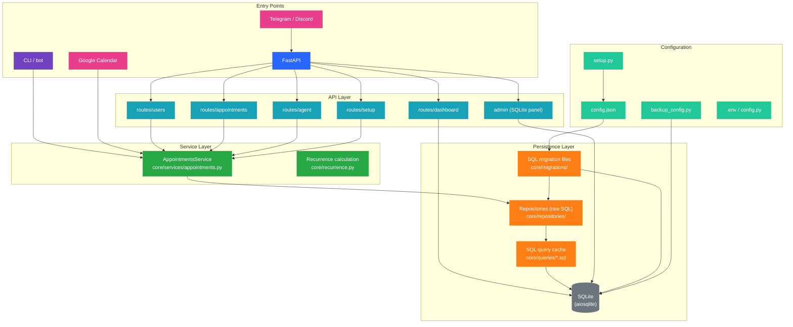

# Micro Appointments

A small scheduling app for managing doctors or staff calendars, appointment types, and booked availability. It uses **SQLite via aiosqlite** for persistence, **raw SQL** repositories with cached query files, a **FastAPI** API for interacting with the calendar, and configuration-driven user setup.

[](https://github.com/LucasOlivieri/micro-appointments/actions/workflows/ci.yml)

## Features

- Configurable users with timezone-aware calendar rules
- Recurring weekly availability rules (RRULE support)
- Appointment type definitions with duration and advance-notice values
- Blocked time ranges for vacations or maintenance
- Booking logic that prevents double-booking
- Setup UI (`/setup`) — browser-based CRUD for users, rules, appointment types, blocked times
- Admin panel (`/{ADMIN_URL}`) — SQLite database browser with HTTP Basic Auth
- Read-only dashboard (`/dashboard`) for calendar overview
- Agent tooling for an LLM-style assistant to operate the calendar
- Telegram webhook integration for the receptionist assistant
- Discord bot integration for the receptionist assistant
- Google Calendar integration for syncing booked appointments

## Architecture



## Project structure

- `api/` — FastAPI application and route layer
- `api/admin/` — SQLite admin panel (DB browser, mounted at `/{ADMIN_URL}`)
- `api/routes/setup.py` — Setup UI CRUD endpoints
- `bot/` — agent/client tooling used by the assistant
- `core/` — scheduling logic, DB bootstrap, migration, service orchestration, and repository layer
- `core/services/appointments.py` — `AppointmentsService` orchestrating scheduling and booking behavior
- `core/repositories/` — one async repository per entity, backed by raw SQL (no ORM)
- `core/queries/` — hand-written `.sql` files organized by entity
- `core/migrations/` — project-managed SQL migration files
- `integrations/` — Telegram, Discord, and Google Calendar integration implementations
- `tests/` — pytest coverage for app behavior
- `config.json` — runtime user configuration used to seed the database
- `config.py` — environment-variable-based configuration (loaded via `python-dotenv`)
- `setup.py` — interactive config generator (CLI)
- `backup_config.py` — export database state back to `config.json` format

## Core architecture

The business layer keeps persistence concerns inside `core/` and keeps the API layer thin and unaware of database detail.

- `core/models.py` defines plain Python `@dataclass` models matching the SQLite schema.
- `core/repositories/` provides async repository modules for each entity backed by **raw SQL** queries cached in `core/queries/*.sql` — no ORM is used.
- `core/services/appointments.py` contains `AppointmentsService`, which orchestrates booking, scheduling rules, and CRUD operations using the repositories instead of direct database calls.
- `api/` only accepts request payloads, delegates to the service, and serializes responses.

This keeps the service reusable in tests, scripts, and integrations without coupling it to FastAPI or HTTP-specific concerns.

## Configuration

Configuration is split across two sources:

| Source | Purpose |
|--------|---------|
| `.env` / environment variables | API keys, model selection, feature flags, credentials |
| `config.json` | Scheduling data — users, rules, appointment types, blocked times |

### Environment variables (`.env`)

All runtime configuration lives in environment variables loaded from `.env` via `python-dotenv`. Key variables:

| Variable | Default | Description |
|----------|---------|-------------|
| `APPOINTMENTS_API_URL` | `http://127.0.0.1:8000` | Base URL for the API (used by the agent) |
| `OPENAI_API_KEY` | — | LLM provider key |
| `OPENAI_MODEL` | `gpt-4o-mini` | Model name for the agent |
| `OPENAI_BASE_URL` | — | Custom base URL (e.g. OpenRouter) |
| `APPOINTMENTS_USER_ID` | — | Default user ID for the agent |
| `AGENT_MEMORY_PATH` | `memory.sqlite3` | Path to agent conversation memory DB |
| `DASHBOARD_SUPERUSER_KEY` | — | Superuser key for the read-only dashboard |
| `ADMIN_USER` | `admin` | HTTP Basic Auth user for the SQLite admin panel |
| `ADMIN_PASSWORD` | `admin` | HTTP Basic Auth password |
| `ADMIN_URL` | `admin` | URL prefix for the admin panel (set to a secret value) |

Integration flags are documented in their respective sections below.

### Scheduling data (`config.json`)

The app reads scheduling data from `config.json`.

Example structure:

```json
{
  "users": [
    {
      "id": "user-uuid",
      "name": "Dr. Example",
      "email": "doctor@example.com",
      "timezone": "America/Argentina/Buenos_Aires",
      "rules": [
        {
          "id": 1,
          "user": "user-uuid",
          "rrule": "FREQ=WEEKLY;BYDAY=MO",
          "start": "09:00",
          "end": "17:00"
        }
      ],
      "appointment_types": [
        {
          "id": 1,
          "user": "user-uuid",
          "name": "Follow-up",
          "duration_minutes": 15
        }
      ],
      "blocked_times": [
        {
          "id": 1,
          "user": "user-uuid",
          "reason": "vacation",
          "start": "2026-01-01T00:00:00+00:00",
          "end": "2026-01-03T00:00:00+00:00"
        }
      ]
    }
  ]
}
```

### Generate or update config

```bash
python setup.py
```

You can also set a custom output path or timezone:

```bash
python setup.py --output config.json --timezone UTC
```

### Backup config from database

To create a timestamped backup of the current configuration stored in the database:

```bash
python backup_config.py
```

This generates a file like `config_backup_2026-08-29_14-30-45.json` in the project root.

Options:

```bash
python backup_config.py --output-dir ./backups  # Save to custom directory
python backup_config.py --verbose               # Show detailed export statistics
```

Backups include all users, rules, appointment types, and blocked times in the same format as `config.json`.

## Database setup

The app initializes SQLite via `aiosqlite` in `core/db.py`. On startup it applies project-managed SQL migrations (plain SQL files in `core/migrations/`), then syncs data from `config.json` into the database tables.

Persistence access is encapsulated behind the repository layer in `core/repositories/`, each backed by **hand-written raw SQL queries** — no ORM is used. Query files live under `core/queries/` organized by entity. This gives full control over SQL while keeping the async database access pattern used throughout the app.

Services like `AppointmentsService` remain the orchestration point for scheduling logic, keeping the repository and service independent from the API.

## Setup UI (`/setup`)

A browser-based management interface is available at `/setup` on the running API host. It requires the superuser key configured via `DASHBOARD_SUPERUSER_KEY` in `.env`.

From the Setup UI you can:

- **Users** — create, update, and delete users
- **Rules** — manage weekly availability rules per user
- **Appointment types** — configure duration and advance-notice per type
- **Blocked times** — schedule vacation, maintenance, or closed periods

All changes are persisted immediately to the database and reflected in the API's scheduling logic.

## Admin panel (`/{ADMIN_URL}`)

A full SQLite database browser is mounted under the URL prefix configured by `ADMIN_URL` (default: `/admin`). Access is protected by HTTP Basic Auth using `ADMIN_USER` / `ADMIN_PASSWORD` from `.env`.

From the admin panel you can browse, search, and edit any table in the SQLite database. It's useful for inspecting raw data, debugging, or making manual corrections.

**Security tip:** Set `ADMIN_URL` to a random unguessable string (e.g. a UUID) instead of the default `admin`.

## Run the API

Using `uv`:

```bash
uv run uvicorn api.main:app --reload
```

Then open:

- http://localhost:8000/docs for the FastAPI Swagger UI

### Telegram integration

Telegram is disabled by default. To enable it, configure the following environment
variables before starting the API:

```text
TELEGRAM_ENABLED=true
TELEGRAM_BOT_TOKEN=your-bot-token
TELEGRAM_WEBHOOK_URL=https://your-domain.example/integrations/telegram/webhook
TELEGRAM_WEBHOOK_SECRET=optional-secret
```

The application registers the webhook during startup and removes it during shutdown.
All Telegram chats use the same receptionist agent. The agent determines which
appointment user applies based on the conversation. Invalid Telegram configuration or
startup failures are logged without preventing the API from starting.

### Discord integration

Discord is disabled by default. To enable it, configure the following environment
variables before starting the API:

```text
DISCORD_ENABLED=true
DISCORD_BOT_TOKEN=your-bot-token
```

The bot uses the `message_content` intent to read messages and responds in the
same channel using the shared receptionist agent. It shows a typing indicator
while the agent is processing. Each channel+author pair gets its own conversation
session.

To set up the bot:

1. Go to the [Discord Developer Portal](https://discord.com/developers/applications).
2. Create a new application and navigate to the **Bot** section.
3. Under **Privileged Gateway Intents**, enable **Message Content Intent**.
4. Copy the bot token and set it as `DISCORD_BOT_TOKEN`.
5. Invite the bot to your server using the OAuth2 URL generator with `bot` scope and `Send Messages` + `Read Message History` permissions.

Invalid Discord configuration or startup failures are logged without preventing
the API from starting.

### Google Calendar integration

Google Calendar is disabled by default. To enable it, configure the following
environment variables before starting the API:

```text
GOOGLE_CALENDAR_ENABLED=true
GOOGLE_OAUTH_CLIENT_SECRET=client_secret_xxxxx.json
GOOGLE_TOKEN_FILE=google_token.json
```

The integration uses **Google OAuth 2.0 (desktop flow)** to sync booked
appointments. The first time the API starts, it will print a URL to visit in
your browser for authorization. After authorizing, the token is saved to
`GOOGLE_TOKEN_FILE` for subsequent runs.

The doctor's email (from the user's `email` field in `config.json`) is added
as an event attendee.

**What gets synced:**

| Action | Calendar effect |
|--------|----------------|
| Appointment created (`POST /appointments`) | Event created on the authenticated user's primary calendar |
| Appointment rescheduled (`PATCH /appointments/{id}`) | Event start/end updated |
| Appointment cancelled (`DELETE /appointments/{id}`) | Event removed from calendar |

Only appointments with `reason='booked'` trigger calendar events — vacations,
maintenance, and other blocked-time ranges are ignored.

**OAuth setup:**

1. Go to the [Google Cloud Console](https://console.cloud.google.com/).
2. Create a project (or select an existing one).
3. Enable the **Google Calendar API**.
4. Under **Credentials**, create an **OAuth 2.0 Client ID** (Desktop app type).
5. Download the JSON file and save it as `client_secret_xxxxx.json`.
6. Set `GOOGLE_OAUTH_CLIENT_SECRET` to the path of that file.

Invalid configuration or API failures are logged without preventing the API
from starting.

## Dashboard

Open `/dashboard` on the API host to use the read-only dashboard. Configure the
admin login with `DASHBOARD_SUPERUSER_KEY` in `.env`. A user logs in with the
existing user's `id` as the key. Admins see all stored data; user logins only
see their own calendar and related customers. Dashboard sessions are held in
memory and are lost when the API restarts.

## Deploy

### 1. Configure environment

```bash
cp .env.example .env
# Edit .env with your own values (API keys, secrets, etc.)
```

### 2. Run with Docker

```bash
docker build -t micro-appointments:local .
docker run -p 8000:8000 \
  -v "$(pwd)/config.json:/app/config.json" \
  -v "$(pwd)/.env:/app/.env" \
  micro-appointments:local
```

### 3. Run without Docker

```bash
uv sync
uv run uvicorn api.main:app --reload
```

The Dockerfile uses a multi-stage build — `uv` exports pinned dependencies in the builder stage, then only runtime deps are installed in the slim runtime image. Configuration and secrets come from mounted volumes; the `.env` file is **not** baked into the image.

Then open:

- http://localhost:8000/docs for the FastAPI Swagger UI

## Run tests

```bash
uv run pytest
```

## Run CI checks locally (before push)

Use the same checks that run in CI so you catch issues before pushing:

```bash
# 1) Sync project dependencies
uv sync --group test

# 2) Install CI tooling in your local env (one-time)
uv pip install ruff black ty bandit

# 3) Run quality checks
uv run ruff check .
uv run black --check .
uv run ty check api core bot
uv run bandit -q -r api core bot

# 4) Run tests
uv run pytest -q
```

## Pre-commit hooks

The project includes a `.pre-commit-config.yaml` with the following hooks:

| Hook | Stage | Description |
|------|-------|-------------|
| `trailing-whitespace`, `end-of-file-fixer`, `check-yaml`, `check-added-large-files` | commit | General file hygiene |
| `ruff` | commit | Lint and auto-fix |
| `black` | commit | Code formatting |
| `bandit` | push | Security scan (`api`, `core`, `bot`) |
| `ty` | push | Type checking (`api`, `core`, `bot`) |
| `pytest` | push | Run test suite |

Install the hooks with:

```bash
uv run pre-commit install --hook-type pre-commit --hook-type pre-push
```

To run all hooks manually:

```bash
uv run pre-commit run --all-files
```

## Notes

- Times are stored as ISO 8601 strings with timezone information.
- The booking logic checks working hours, blocked ranges, and appointment duration before creating a reservation.
- The app is designed to support multiple users, each with their own rules and appointment types.
